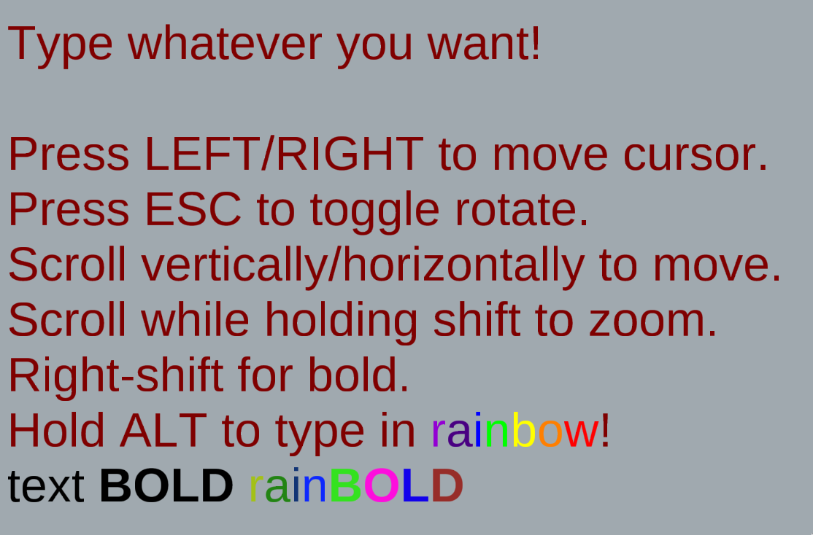

GLLabel - GPU Vector Text Rendering
==========

A C++ class for rendering vector text in OpenGL.

This rendering method allows text to be arbitrarily scaled and rotated,
just as it could be with CPU-rendered text. This method does not use
Valve's Signed Distance Fields, and can load text quickly from TTF font
files in real-time.

This code is not "polished" yet, and there is still work to be done (some
glyphs, especially complex glyphs from Chinese Or Japanese, may not render
perfectly). Also, this does not use a good shaping engine such as HarfBuzz,
so don't expect anything other than Latin-based scripts to look particularly
good. Maybe one day I'll get around to implementing better text layout.

Documentation is commented throughout the code, however some parts are quite
complex. Contact me with any questions and I'll attempt to respond.

Screenshot:

Thanks and License
--------

This code was made possible by [work from Will Dobbie](http://wdobbie.com).
The process used to render the text, as well as most of the fragment shader,
was designed by Dobbie. Dobbie did not provide any license for his work,
but seemed to imply that the code and algorithm are freely available for use.
Until further notice, all of the code except the fragment shader is under the
Apache License v2.0. The fragment shader code is unlicensed.
